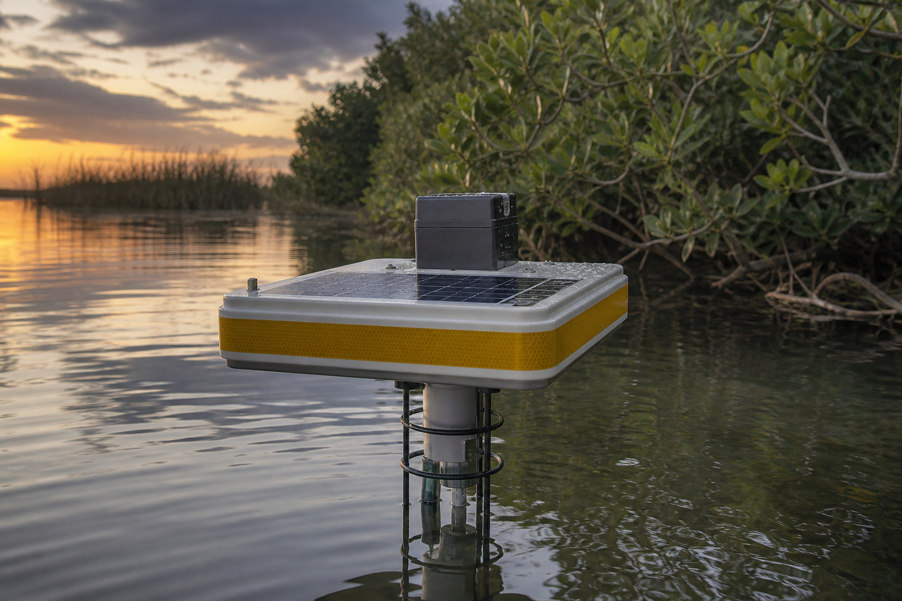
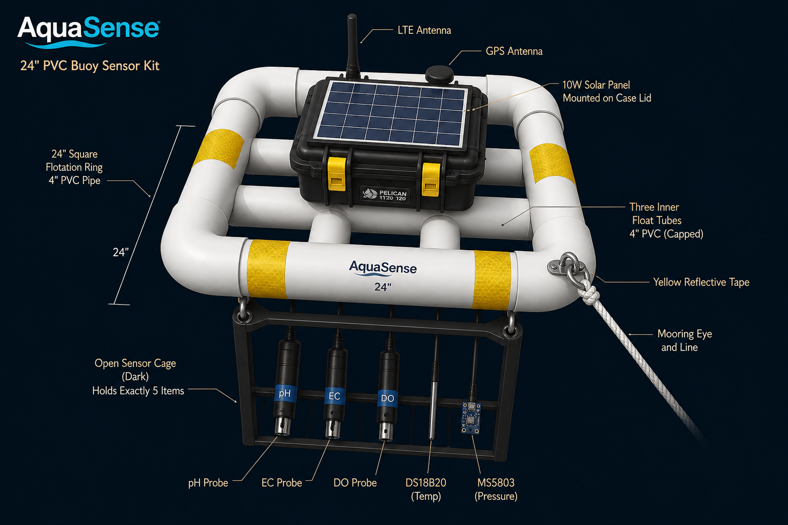

# AquaSense

**A solar buoy that sits on the water, measures a few stats, uses cellular internet to send them to a website you host.**



Open-source hardware kit. Order the parts, build the hull, flash the board, point it at **your** ingest URL. This repository is the kit. **We host no servers, no database, and no live fleet.**

GitHub Pages is documentation plus a [dashboard of fixture JSON](https://itscool2b.github.io/AquaSense/dashboard/) labeled **simulated**. Live numbers come from `docker compose up` on a machine you control. After the first push, set the repo’s Pages source to **GitHub Actions**.

## What it sends

Every 15 minutes the board wakes, samples, writes CSV on the microSD card, HTTPS POSTs, and sleeps:

`device_id`, `token`, `ts`, `lat`, `lon`, `temp_c`, `ph`, `spcond_ms_cm`, `sal_psu`, `do_mgl`, `do_pct`, `depth_m`, `batt_v`, `rssi`, `fw`

Temperature, pH, conductivity → practical salinity, dissolved oxygen (mg/L and %), depth, plus GPS, battery, and time. **No turbidity** — the cheap analog probe is not waterproof and is not NTU.


## Cost, honestly

A [YSI EXO2](https://www.ysi.com/exo2) lists around **$7,300–$8,450** before sensors ([Fondriest](https://www.fondriest.com/ysi-exo2-multiparameter-sonde.htm)). A NexSens-class buoy is another few thousand. This kit’s [BOM](bom/bom.csv) sums to about **$780** of street prices — check the linked pages; they move.

This hardware **has not been in a lake**. Specs are copied from manufacturer wikis. See [limits](https://itscool2b.github.io/AquaSense/docs/accuracy/).

## One board

[LilyGO T-A7670G R2 **with GPS**](https://www.amazon.com/LILYGO-T-A7670G-Module-Development-Support/dp/B0CLLNMRX7) — ESP32, LTE Cat-1, L76K GNSS, microSD, 18650 sled, 5–6 V solar jack. Florida preserves have no Wi-Fi. Do not buy the Without-GPS ASIN `B0CLLNK4MX`.

Default assembly is **Gravity cables on a screw-terminal block** in an IP67 box. No custom PCB, no soldering required for the default path.

## Firmware

```bash
cd firmware
make test                          # UNESCO / Benson–Krause checks
pio run -e lilygo-t-a7670g         # compile for the buoy
```

HTTPS uses [TinyGSM-fork (lewisxhe)](https://github.com/lewisxhe/TinyGSM-fork) (`-DTINY_GSM_MODEM_A7670 -DTINY_GSM_FORK_LIBRARY`). ESP32 ADC is 12-bit millivolts, not Uno `1024*5000`. Pin map: [`hardware/pinmap.md`](hardware/pinmap.md).

SD card `config.json` (from [`firmware/data/config.example.json`](firmware/data/config.example.json)):

```json
{
  "ingest_url": "https://YOUR-HOST/api/v1/ingest",
  "device_id": "buoy-01",
  "token": "change-me",
  "apn": "iot.1nce.net",
  "sample_period_s": 900
}
```

## Your website

```bash
cd selfhost
cp .env.example .env
docker compose up --build
python3 ../scripts/simulate-buoy.py
```

Open http://127.0.0.1:8080. The LTE radio cannot see localhost — put the same stack on a VPS (or a tunnel) before the bucket test.

## Build

Numbered high-school steps: [buy → host → flash → config → calibrate → wire → hull → bucket → water](https://itscool2b.github.io/AquaSense/build/).



## Licenses

| Tree | License |
|---|---|
| Firmware and site | [MIT](LICENSE) |
| Hardware | [CERN-OHL-S-2.0](LICENSE.hardware) |
| Docs and diagrams | [CC BY 4.0](LICENSE.docs) |
