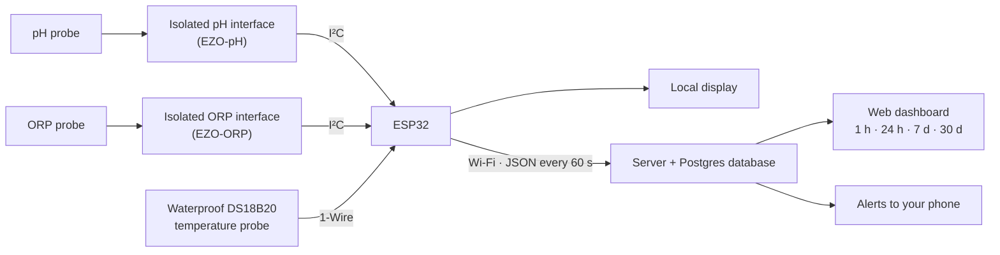
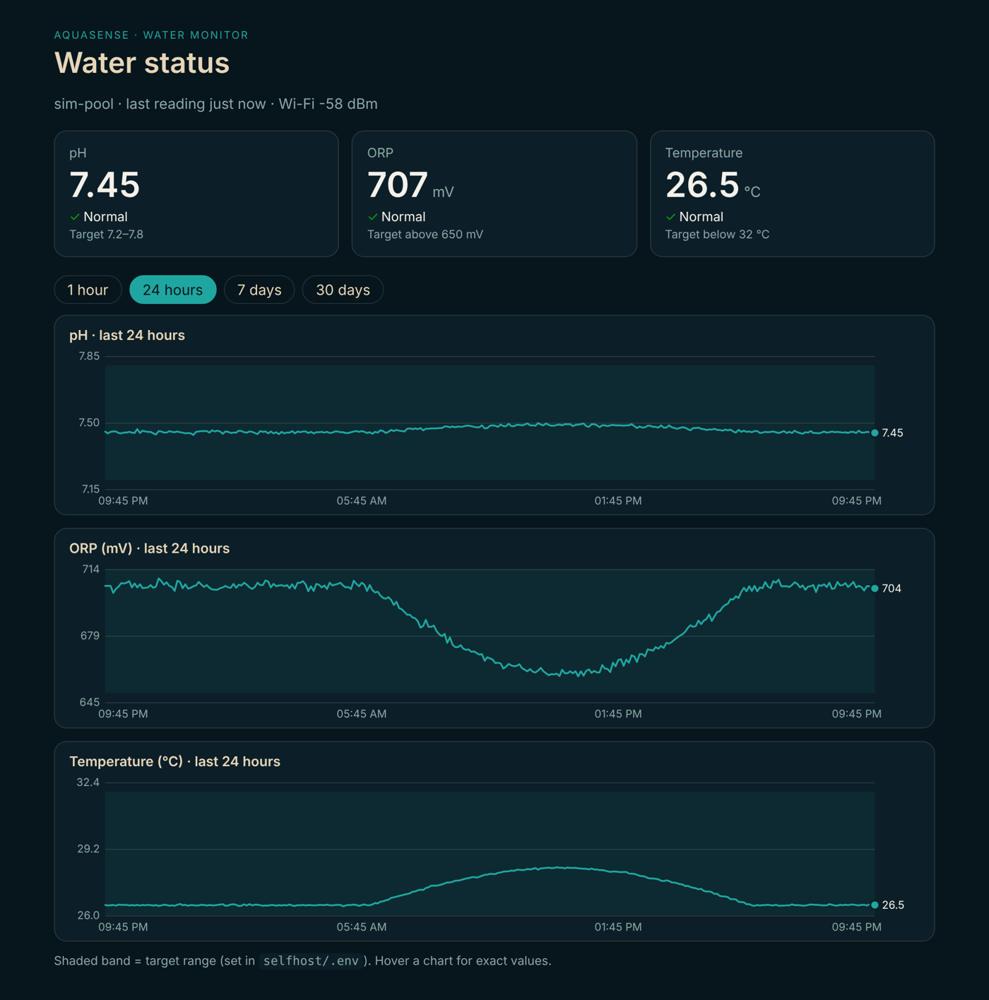

# AquaSense

**An open-source water-quality monitor that measures pH, ORP, and temperature around the clock and sends
the readings over Wi-Fi to a dashboard you can check from your phone.**

[](LICENSE)
[](LICENSE.hardware)
[](LICENSE.docs)

<p align="center">
  
</p>

Water chemistry changes all day. Sunlight burns off chlorine, rain dilutes it, and swimmers, filtration
and chemical additions shift pH. A test strip only shows one moment, taken by hand. AquaSense measures every
few seconds, keeps the history, and warns you when something stays out of range.

All of it is open: firmware, wiring, parts list, enclosure layout, server, database schema, and dashboard.
Anyone can build one, check how it works, or improve it.

## What it does

- **Measures continuously:** pH, ORP (oxidation-reduction potential, a measure of how strongly the water can
  sanitize) and water temperature.
- **Corrects pH for temperature** automatically, so readings stay consistent as the water warms and cools.
- **Shows live values** on a small display on the box.
- **Logs everything over Wi-Fi** to a database, with graphs for the last hour, day, week, and month.
- **Sends alerts** when a value stays out of range, a sensor stops answering, or the monitor goes offline.
- **Has room to grow:** a spare isolated port takes one more compatible sensor.

## Who it can help

| Use | What AquaSense shows |
|---|---|
| Home and community pools | Whether pH and sanitizer (ORP) stay in range between manual tests, and how they react to sun, rain, swimmers, and chemical additions |
| Aquariums, ponds, hydroponics | Slow pH drift and temperature swings that are easy to miss with occasional testing |
| Classrooms and science projects | Real, continuous chemistry data, plus a complete sensor-to-cloud system students can build and modify |
| Makers on a budget | A documented path to a ~$420 monitor instead of a closed commercial unit |

## How it works


```mermaid
flowchart LR
    PH[pH probe] --> PHI["Isolated pH interface<br/>(EZO-pH)"]
    ORP[ORP probe] --> ORPI["Isolated ORP interface<br/>(EZO-ORP)"]
    T[Waterproof DS18B20<br/>temperature probe]
    PHI -- I²C --> ESP[ESP32]
    ORPI -- I²C --> ESP
    T -- 1-Wire --> ESP
    ESP --> OLED[Local display]
    ESP -- "Wi-Fi · JSON every 60 s" --> SRV[Server + Postgres database]
    SRV --> DASH["Web dashboard<br/>1 h · 24 h · 7 d · 30 d"]
    SRV --> ALERT[Alerts to your phone]
```

1. Every 2 seconds, the ESP32 reads the temperature probe and sends that temperature to the pH interface for
   compensation. Then it reads pH and ORP.
2. It throws out impossible values and sudden spikes (`7.41, 7.40, 12.98, 7.41`: the `12.98` is electrical
   noise), then averages the last 10 good readings.
3. Every 60 seconds, it uploads one measurement:
   ```json
   {"device_id": "backyard-pool", "ph": 7.42, "orp": 681, "temperature": 27.4}
   ```
4. The server stores it, draws the graphs, and checks the alert rules.

<p align="center">
  
  <br><em>The dashboard, shown here with test data from <code>scripts/simulate-device.py</code>.</em>
</p>

### Why the probes get the budget

A $12 ESP32 is all the computer this needs. Measurement quality comes from the **probes**, the
**signal-conditioning boards**, **electrical isolation** and **calibration**. A pH probe makes a tiny,
very-high-impedance voltage that cannot go straight into a microcontroller. AquaSense uses dedicated pH and
ORP interface boards that digitize the signal and send finished numbers over I²C. Both sit on isolated
carriers, so the two probes in the same water can't interfere with each other.

## Build your own

The build goes in layers, and each part is tested before the next is added. Every layer has a small test
sketch in [`firmware/examples/`](firmware/examples/).

### 1. Get the parts (~$420)

| Part | Approx. |
|---|---|
| ESP32 development board | $12 |
| EZO-pH and EZO-ORP interface boards (Atlas Scientific) | $92 |
| 2 × electrically isolated carrier boards | $66 |
| pH probe and ORP probe | $124 |
| Waterproof DS18B20 temperature probe (with 4.7 kΩ resistor) | $10 |
| 128×64 I²C OLED display (optional) | $20 |
| Weatherproof clear-lid enclosure, cable glands, SMA panel jacks | $44 |
| 5 V UL-listed USB power supply | $8 |
| pH 4 / 7 / 10 and ORP 225 mV calibration solutions | $34 |
| Breadboard, jumper wires, distilled water | $12 |

Full list with part numbers, links, and specs: [`bom/bom.csv`](bom/bom.csv).

### 2. Build and test layer by layer

Install the [Arduino IDE](https://www.arduino.cc/en/software), add ESP32 board support (Boards Manager →
"esp32 by Espressif Systems"), and install the libraries **OneWire**, **DallasTemperature** and **U8g2**.
Open the Serial Monitor at 115200 baud.

| Layer | Add | Upload | You should see |
|---|---|---|---|
| 1 | ESP32 only, nothing else wired | `examples/01_hello` | `System running` once a second |
| 2 | DS18B20 on GPIO 4, 4.7 kΩ to 3.3 V | `examples/02_temperature` | `Temperature: 25.63 C` with the probe in water |
| 3 | pH board + probe on I²C (GPIO 21/22) | `examples/03_ph` | The reading changes between distilled water, tap water, and pH 7 solution |
| 4 | ORP board + probe on the same bus | `examples/04_orp` | `pH: 7.01 \| ORP: 225 mV` in the calibration solutions |
| 5 | All three, filtering, display | `AquaSense/AquaSense.ino` | `Temperature: 27.3 C \| pH: 7.41 \| ORP: 684 mV` on serial and the display |
| 6 | Wi-Fi + server (step 4 below) | `examples/05_wifi_post`, then `AquaSense` | `POST -> 200` and new points on the dashboard |

Wiring diagram, pin map, and how to switch the interface boards to I²C: [`hardware/README.md`](hardware/README.md).

### 3. Calibrate

The interface boards store their calibration in their own memory, so it survives power loss.

**pH** (three points; always start with 7, because calibrating the midpoint clears the others):

1. Rinse the probe with distilled water. Shake or blot off the excess; don't wipe the glass bulb.
2. Put it in a pH 7.00 solution and wait until the reading stops changing.
3. Type `cal ph 7`.
4. Rinse, then repeat with pH 4.00 (`cal ph 4`) and pH 10.00 (`cal ph 10`).

**ORP:** Put the probe in the 225 mV solution, wait for it to settle, then type `cal orp 225`. If the box
reads 218 mV, it now applies the +7 mV correction itself.

Recalibrate pH about every 3 months.

### 4. Run the server and dashboard

On any computer that stays on, such as a Raspberry Pi, an old laptop, or a small cloud server, with
[Docker](https://docs.docker.com/get-docker/) installed:

```bash
git clone https://github.com/itscool2b/AquaSense.git
cd AquaSense/selfhost
cp .env.example .env          # set INGEST_TOKEN to a long random string
docker compose up -d --build
```

Open `http://<that-computer's-IP>:8080`. To see the dashboard work before any hardware is ready:

```bash
COUNT=1440 python3 ../scripts/simulate-device.py   # one day of test data
```

Then point the monitor at the server by typing into its Serial Monitor. Settings are saved in the
ESP32's flash, never in the code:

```
ssid My Home WiFi
password your-wifi-password
server http://192.168.1.50:8080/api/v1/measurements
token the-same-INGEST_TOKEN
device backyard-pool
```

**Alerts.** The defaults suit a chlorinated pool. Change them in `selfhost/.env`, and check your local
guidelines.

| Alert | Default |
|---|---|
| pH too low / too high | below 7.2 or above 7.8 for 15 minutes |
| ORP too low | below 650 mV for 15 minutes |
| Temperature too high | above 32 °C for 15 minutes |
| Sensor not responding | the last upload is missing that sensor |
| Monitor offline | no data for 5 minutes |

Alerts appear on the dashboard. For push notifications on your phone, set `ALERT_WEBHOOK_URL` to an
[ntfy](https://ntfy.sh) topic and subscribe to it in the ntfy app.

### 5. Install it

- Move the tested electronics into the enclosure. Use cable glands or waterproof jacks wherever a cable
  leaves the box.
- Mount the box away from splashing.
- **Keep it low voltage.** Power goes wall outlet → UL-listed 5 V USB adapter → box. Near a pool, the outlet
  must be GFCI-protected. Never put mains wiring inside the box.
- Keep the probes submerged, in moving water, away from air bubbles, chemical injection points, and pumps.
  A return line or sampling chamber is ideal.

Details and drawings: [`hardware/README.md`](hardware/README.md).

### 6. Prove it is accurate

Don't trust a new instrument automatically. For several days, compare it against a reference tester:

```
Reference pH:  7.44
AquaSense pH:  7.41
Difference:   -0.03
```

Track the average error, the largest error, and the standard deviation. Then leave it running for 24 hours,
then a week, and watch for Wi-Fi drops, slow drift, random spikes, probe fouling, and power interruptions.
The firmware reconnects to Wi-Fi on its own and sends `null` rather than a made-up number when a sensor
stops answering.

## Accuracy and limits

| Measurement | Range | Probe accuracy (manufacturer spec) |
|---|---|---|
| pH | 2–13 (probe) | ±0.1 pH |
| ORP | −1100 to 1100 mV | ±1.1 mV |
| Temperature | −10 to 85 °C | ±0.5 °C |

- The pH and ORP probes are rated for water between 1 and 60 °C.
- Real-world accuracy depends on calibration and probe condition. Consumer pH and ORP probes last about
  12–18 months.
- ORP shows sanitizing strength. It does **not** directly measure chlorine in ppm.
- AquaSense is a monitoring tool, not a certified laboratory or regulatory instrument. Keep testing
  manually as your water-safety rules require.

## Repository

| Path | Contents |
|---|---|
| [`firmware/`](firmware/) | ESP32 firmware, one test sketch per build layer, filter unit tests |
| [`hardware/`](hardware/) | Wiring, pin map, interface board setup, enclosure, power safety, probe mounting |
| [`bom/bom.csv`](bom/bom.csv) | Parts list with part numbers, prices and datasheets |
| [`selfhost/`](selfhost/) | Server (FastAPI + Postgres), dashboard, alert rules, Docker setup |
| [`scripts/simulate-device.py`](scripts/simulate-device.py) | Sends test data so you can try the dashboard without hardware |

## License

Free to use, build, modify, and share:

| Part | License |
|---|---|
| Firmware and software | [MIT](LICENSE) |
| Hardware design | [CERN-OHL-S-2.0](LICENSE.hardware) |
| Documentation and images | [CC BY 4.0](LICENSE.docs) |

Improvements are welcome. See [CONTRIBUTING.md](CONTRIBUTING.md).
