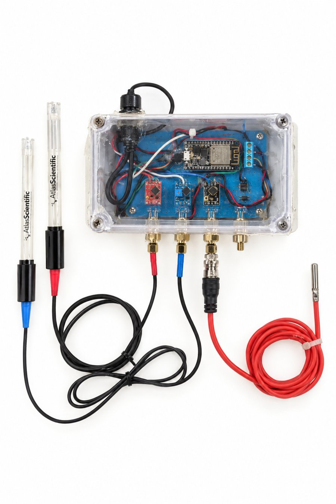

# Hardware

Everything needed to wire and box an AquaSense monitor. Parts and prices: [`../bom/bom.csv`](../bom/bom.csv).



## Wiring

All signals are 3.3 V. Everything shares one ground.

```
                              ESP32 DevKit
                         ┌──────────────────┐
  DS18B20 red ───────────┤ 3V3              │
  DS18B20 black ─────────┤ GND              │
  DS18B20 yellow ──┬─────┤ GPIO 4           │
                   └─[4.7 kΩ]── 3V3         │
  I2C SDA ───────────────┤ GPIO 21          │
  I2C SCL ───────────────┤ GPIO 22          │
                         │            USB ◄─┼── 5 V USB power supply
                         └──────────────────┘

  I2C bus (GPIO 21 / 22) ─┬─ pH carrier board   (EZO-pH,  address 0x63)
                          ├─ ORP carrier board  (EZO-ORP, address 0x62)
                          └─ OLED display       (address 0x3C, optional)
```

### Pin map

| Connection | ESP32 pin | Notes |
|---|---|---|
| DS18B20 data (yellow or white) | GPIO 4 | 4.7 kΩ pull-up between GPIO 4 and 3V3 |
| DS18B20 power (red) / ground (black) | 3V3 / GND | |
| pH carrier **TX** (= SDA in I²C mode) | GPIO 21 | |
| pH carrier **RX** (= SCL in I²C mode) | GPIO 22 | |
| pH carrier VCC / GND | 3V3 / GND | Leave the OFF pin unconnected |
| ORP carrier TX / RX / VCC / GND | 21 / 22 / 3V3 / GND | Same bus as pH |
| OLED SDA / SCL / VCC / GND | 21 / 22 / 3V3 / GND | Optional |

The same numbers are in [`firmware/AquaSense/config.h`](../firmware/AquaSense/config.h).

### Why I²C instead of analog

A pH probe produces a tiny voltage at extremely high impedance, so it must never connect straight to the
ESP32. The EZO boards amplify and digitize it, and send a finished number over I²C. Their carrier boards
are **electrically isolated**: the pH and ORP probes sit in the same water, and without isolation one
probe's circuit can pull the other's reading.

### Switch each EZO board to I²C (once)

EZO boards ship in UART mode. Before mounting each one on its carrier:

1. Power off. Disconnect TX and RX.
2. Connect the board's **TX** pin to its **PGND** pin. Leave RX disconnected.
3. Power on and wait for the LED to change from green to blue.
4. Power off, remove the jumper, reconnect normally.

The pH board comes up at address 99 (0x63) and the ORP board at 98 (0x62). Source: the
[EZO-pH datasheet](https://files.atlas-scientific.com/pH_EZO_Datasheet.pdf), "Manual switching to I²C".

If your boards stay in UART mode instead, use GPIO 16 (RX2) and GPIO 17 (TX2) for one board. A second UART
board needs another serial port. I²C is simpler: two wires for everything.

## Enclosure

```
┌────────────────────────────────┐
│          OLED display          │   clear lid: read it without opening
│                                │
│             ESP32              │
│                                │
│   pH carrier     ORP carrier   │
│                                │
├────────┬────────┬──────┬───────┤
│  pH    │  ORP   │ spare│ temp  │   SMA panel jacks + PG-9 gland
└────────┴────────┴──────┴───────┘        power cable: second gland
```

- Use cable glands (or the waterproof SMA panel jacks) wherever a cable leaves the box. Silicone the threads.
- Mount the box above splash height, with the glands pointing down so water runs off.
- The spare SMA jack leaves room for one more EZO sensor, such as conductivity or dissolved oxygen.

## Power and safety

```
wall outlet (GFCI near water) → UL-listed 5 V USB adapter → USB cable → enclosure
```

- Only 5 V goes into the box. No mains wiring, relays or pumps inside.
- Near a swimming pool, the outlet must be GFCI-protected and the install must follow local electrical
  and pool-safety rules.

## Mounting the probes

```
        cable
          │
──────────┼────────── pool edge / tank wall
          │
     pH   ORP   temp
          │
        water
```

Keep the probes:

- submerged to the depth the probe maker requires, never dry (a dried pH bulb is ruined),
- in moving water, away from air bubbles,
- away from chemical injection points and strong electrical equipment (pumps, heaters).

A pool return line or a sampling chamber gives the steadiest readings.
